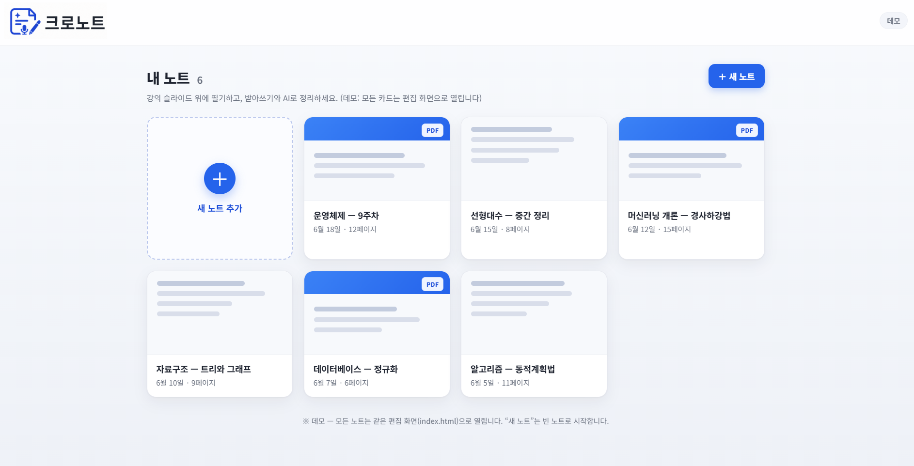

# 🗂️ 크로노트 (CHRONOTE) — 대학생 특화 통합 AI 학습 노트

> **아주대학교 STARTUP BUILD AI 창업캠프 최우수상 (2위) 수상작**
> 
> "흩어진 강의 PDF, 내 손필기, 교수님의 음성 녹음(STT)을 단일 타임라인으로 묶어 교차 인용 Q&A를 지원하는 대학생 특화 AI 복습 도구"


*데모 홈 화면 및 편집 화면 예시*

---

## 🚀 프로젝트 개요

*   **진행 기간:** 2026년 6월 (1박 2일 해커톤)
*   **주요 성과:** 아주대학교 STARTUP BUILD AI 창업캠프 최우수상(2위) 수상
*   **역할:** UI/UX 디자인 주도, MVP 프론트엔드 프로토타입 공동 개발
*   **핵심 가치:** 4가지 파편화된 도구(굿노트, 노션, 클로바노트, NotebookLM)를 하나로 묶어 복습의 인지 부하를 줄이고, AI 토큰 비용을 방어하는 온디맨드 구조 설계.

---

## 💡 문제 정의 & 창업 가설

### 1. 대학생의 실제 페인 포인트: "4-앱 짜깁기 학습"
대학생들이 하나의 강의를 복습하기 위해 평균적으로 3~4개의 도구를 번갈아 사용하며 컨텍스트가 계속 끊어집니다.
*   **필기:** 굿노트 / 삼성노트 (필기 내용이 검색 및 AI RAG 컨텍스트로 활용되지 못함)
*   **정리:** 노션 (강의 슬라이드 및 실시간 음성 기록과 분리됨)
*   **녹음:** 클로바노트 (STT 전사 텍스트가 개인 필기 타임라인과 결합되지 않음)
*   **질의응답:** ChatGPT / NotebookLM (개인 노트 및 실시간 교수 발언을 맥락으로 인용 불가)

### 2. 핵심 가설: "맥락 통합형 RAG의 가치"
> **"강의 슬라이드 PDF + 필기 내용 + 교수 발언(STT)을 단일 타임라인으로 결합한 '교차 인용 RAG 질의응답'을 제공한다면, 대학생들에게 유의미한 가치(Painkiller)를 제공하고 구독으로 이어질 것이다."**

---

## 🛠️ 기술적 특징 & 의도적 트레이드오프

해커톤의 특성(1박 2일의 제한된 시간과 현장 데모 시연의 중요성)을 고려하여 의도적으로 무겁고 복잡한 서버 환경을 배제하고 **순수 웹 기술 기반의 신속한 프로토타이핑(Vibe Coding)**을 진행했습니다.

### 1. 바닐라 JS 및 HTML5 Canvas 단일 파일 구조
*   빌드 프로세스나 의존성 설정을 완전히 제거하여 **의존성 충돌이나 실행 오류 없이 어떤 기기(태블릿, 모바일, PC)에서든 브라우저 더블클릭만으로 동작하는 데모**를 완성했습니다.
*   `pdf.js` 라이브러리를 클라이언트단에서 연동하여 사용자가 업로드한 PDF 문서를 즉시 캔버스 배경으로 주입하는 기능을 구현했습니다.

### 2. 데모 완성도를 위한 미시적 문제 해결 (디버깅)
짧은 시간이었지만 발표 현장에서 터치 입력 도중 데모가 멈추는 리스크를 예방하기 위해 약 30여 개의 UX 버그를 적대적 검증으로 직접 해결했습니다.
*   **멀티터치 데이터 유실 방지:** 모바일/태블릿 터치 시 싱글 포인터 변수가 덮어씌워져 획이 끊기던 문제를 `Pointer Events API` 기반 포인터 식별용 `Map` 구조로 전환하여 해결.
*   **가상 키보드 뷰포트 대응:** 모바일에서 텍스트 입력 창이 키보드에 가려지거나 좌표가 깨지는 현상을 absolute 좌표계를 캔버스 자식으로 귀속시켜 해결.
*   **고해상도 다운로드:** 기기 해상도(DPR)나 뷰포트 크기에 종속되어 캡처본이 흐려지는 현상을 오프스크린 캔버스를 이용한 고정 해상도 렌더링 방식으로 개선.

### 3. 단위 경제성(Unit Economics) 방어 & 점진적 노출 (UX)
*   **Progressive Disclosure:** 사용자가 처음 진입했을 때는 복잡한 AI 기능을 전면에 내세우지 않고 친숙한 **'일반 필기 노트장'**으로 동작하게 설계하여 사용 장벽을 제거했습니다.
*   **On-Demand AI:** 호출 변동비(STT 전사, LLM API 비용)의 역마진을 예방하기 위해, 필요할 때만 사용자가 직접 활성화하는 온디맨드 스키마로 설계하여 비즈니스 모델의 지속 가능성을 고려했습니다.

---

## 📂 폴더 구조

```bash
├── prototype/
│   ├── home.html           # 대시보드 및 노트 목록 홈 화면
│   ├── index.html          # 필기 및 PDF 로드, STT/AI 목업이 탑재된 편집 화면
│   └── logo.png            # SVG/PNG 로고 파일
├── docs/
│   ├── detail_page/
│   │   ├── DESIGN.md       # 화면 UI/UX 가이드라인 및 설명
│   │   └── screen.png      # 데모 화면 디자인 스크린샷
│   ├── proposal.md         # 창업 아이디어 기획서
│   ├── devlog.md           # 디버깅 및 버전 히스토리
│   └── user_journey.md     # 사용자 경험 지도 분석
```

---

## 🎮 데모 실행 방법

본 프로젝트는 별도의 서버 실행이나 패키지 설치(`npm install`)가 필요하지 않습니다.

1.  본 리포지토리를 클론하거나 다운로드합니다.
2.  `prototype/home.html` 또는 `prototype/index.html` 파일을 크롬 등 웹 브라우저로 엽니다.
3.  (옵션) **📄 PDF 열기** 버튼을 눌러 본인의 강의 PDF 파일을 업로드하면 캔버스 위에서 필기와 텍스트 입력을 직접 테스트해 볼 수 있습니다.

> 💡 **데모 참고 사항:** 본 프로토타입의 '텍스트 전사(STT)' 및 'AI 대화창'은 발표용 시나리오 흐름을 증명하기 위해 정교하게 구성된 프론트엔드 인터랙션 시뮬레이터(Mockup)입니다. 실제 비용 발생 및 API 키 유출을 방지하기 위해 클라이언트 로직으로 시뮬레이션됩니다.
